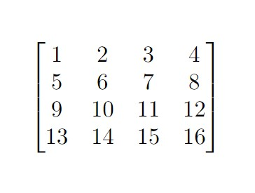
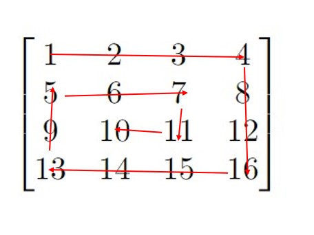

# Array Traversal

This project is aimed to perform the traversal of a 2D Array in the following format: 

Assume a given array of size 4 x 4 as follows: <br>

<br>

The array must be traversed following the path denoted by the red arrows: <br>

<br>

Thus, the traversed order of elements from the above 2D Array would be:
```
[1, 2, 3, 4, 8, 12, 16, 15, 14, 13, 9, 5, 6, 7, 11, 10]
```

The application is written in *Java*, and uses *Maven* as a build tool.

In order to compile and run tests, please ensure the following pre-requisites:
## Pre-requisites

1. JDK 1.8 or higher(with JRE)
2. Apache Maven 

## Building the application
In order to build the application, run the following command from within the directory:
```
mvn clean install
```
In order to run the unit tests defined within the application, run the following command:
```
mvn test
```

## Executing the application
To execute the application, we must first package it as a jar. To do so, we must run the following command:
```
mvn clean package
```

This will create a jar file in the target folder in the project directory as:
```
arrayTraversal
├── pom.xml
├── src/...
└── target
    ├── classes
    │   └── org
    │       └── asml
    │           └── Assignment.class
    ├── test-classes
    │   └── org
    │       └── asml
    │           └── AssignmentTest.class
    └── arrayTraversal-1.0.0.jar
```
Then, we can execute the jar file by running the following from the command line:
```
java -jar target\assignment-1.0.0.jar
```
On running the JAR file, the application runs two sample arrays and provides their traversed result, and waits for input by the user.
<br>
The format of the input expected is as follows:
```
<row size : int>
<column size : int>
<first row of array separated by comma>
<second row of array separated by comma>
.
.
.
<last row of array separated by comma>
```

An example input from the console would look like:
```
4 <-- row size
4 <-- column size
1,2,3,4 <-- first row
5,6,7,8 <-- second row
9,10,11,12 <-- third row
13,14,15,16 <-- fourth row
```

Another example console input with a 3 x 5 2D Array would look like:
```
3
5
1,2,3,4,5
6,7,8,9,10
11,12,13,14,15
```

If you have any questions, feel free to contact me at [debadeep.basu@gmail.com](mailto:debadeep.basu@gmail.com)
